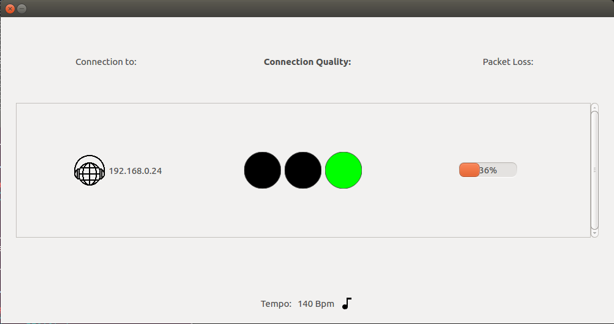

# JackTrip Quality of Service Extension
This Project extends the JackTrip Application with a Quality Model. The Model is used to give the users insight on the quality of the connection to a peer. 

With the additional User Interface, the musicians can see how well the connection handles at any given time during the performance. As shown in the image above, the IP-adress of the peer is listed with the quality model. 

## How to estimate the quality of a networked music performance?
To perform music across a network of computers, there are many constraints to the quality of the internet connection and the underlying network or hardware. 
For synchronous collaboration in music, there are certain boundaries to the quality which need to be passed to make it possible for musicians to play music together in real-time. For example: the latency between the peers should not exceed a certain threshold to make it possible for the musicians to stay synchronized. Other effects like Jitter or Bandwith-Usage should also be kept low, so that there is little to no audio-loss during the performance which could also distract the musicians. 

The technical constraints are not the only factors which make up the quality of a networked music performance. The context of the music which is played and also the context of the participants play a role for the quality. In various research projects, people tried to give an answer on how long the treshold for the latency can be. Their results show that the tempo of the music which is performed has an impact to the latency. Also the choice of instruments for the performance has an influence on the perception of the latency for the musicians. While looking at the results it's clear to see a correlation between tempo and latency. The faster the tempo of the music, the lower the latency needs to be so that musicians can stay synchronized during the performance.

The Quality-Model of this Extension uses the estimated latency to the peer and the estimated tempo of the music and classifies the quality in 4 different categories.  

The diagramm above shows the correlation between the tempo in BPM and latency in milliseconds. For every category the treshold for the latency according to the tempo is shown. The categories are build up as follows: 
- *acceptable*, colored in green 
- *tolerable*, colored in yellow
- *difficult*, colored in red up to a treshold of 150 ms
- *not possible*, everything above 150 ms

## About the Extension
This project was part of a student research project held in the University of Dortmund "Fachhochschule Dortmund".

# About JackTrip
JackTrip is a Linux, Mac OSX, or Windows multi-machine audio system used for network music performance over the Internet.
It supports any number of channels (as many as the computer/network can handle) of bidirectional, high quality, uncompressed audio signal streaming.

You can use it between any combination of machines e.g., one end using Linux can connect to another using Mac OSX.

# Installation
## Linux ##
Linux installation instructions can be found in INSTALL.txt in the src directory of the project.

## OSX or Windows ##
Installers and executables are the easiest way to install Jacktrip.

OSX installer or executable: https://ccrma.stanford.edu/software/jacktrip/osx/index.html 
- Temporary [link](https://www.dropbox.com/s/jb7vh9oiew50cm6/jacktrip-macos-installer-x64-1.2.1.pkg?dl=0) to JackTrip 1.2.1 installer (see more details [here](https://github.com/jacktrip/jacktrip/issues/158#issuecomment-699215590))

Windows installer or executable: https://ccrma.stanford.edu/software/jacktrip/windows/index.html

To keep up with the latest changes, both experimental and stable, follow instructions to compile from source in INSTALL.txt in the src directory of the project.

# Raspberry Pi

[paper](https://lac.linuxaudio.org/2019/doc/chafe2.pdf) accompanying jacktrip demo at [Linux Audio Conference 2019](https://lac.linuxaudio.org/2019/)

# Other Repos
jacktrip (1.0) was released on google code. When that shut down, it migrated to github (1.05, 1.1).
It then moved to the CCRMA's cm-gitlab for version 1.2.
And as of spring 2020 it moved back to GitHub for the current development.

## Links ##
  * Preliminary [Documentation](http://ccrma.stanford.edu/groups/soundwire/software/jacktrip/) and [API](http://ccrma.stanford.edu/groups/soundwire/software/jacktrip/annotated.html).
  * Subscribe to the [Mailing List](http://groups.google.com/group/jacktrip-users).
  * [CCRMA](http://ccrma.stanford.edu/).
  * [SoundWIRE group](http://ccrma.stanford.edu/groups/soundwire/).
  * [Juan-Pablo Caceres](https://ccrma.stanford.edu/~jcaceres/).

## Related Software ##
[JMess](https://github.com/jcacerec/jmess-jack): A utility to save your audio connections (mess).
